# MedTriage-CXR

MedTriage-CXR is an end-to-end AI-assisted chest X-ray triage system for multi-class medical image classification, sensitivity-aware decision tuning, explainability, and deployable inference.

The system classifies chest X-ray images into three triage-relevant categories:

- Normal
- No Lung Opacity / Not Normal
- Lung Opacity

These classes are mapped into triage priorities:

| Class | Label | Triage Priority |
|---|---:|---|
| Normal | 0 | Low Priority |
| No Lung Opacity / Not Normal | 1 | Medium Priority |
| Lung Opacity | 2 | High Priority |

> Disclaimer: This project is for educational and portfolio purposes only. It is not intended for clinical diagnosis or real-world medical decision making.

---

## Project Motivation

In medical triage, accuracy alone is not enough. A model can achieve reasonable overall accuracy while still missing high-priority cases.

This project focuses on building a full machine learning pipeline that includes:

- DICOM image processing
- corrupted file validation
- train, validation, and test splitting
- modern CNN-based classification
- high-sensitivity threshold tuning
- Grad-CAM explainability
- Streamlit demo app
- FastAPI inference endpoint

The main goal is not only to classify X-rays, but also to demonstrate how an ML system can be designed for practical triage workflows.

---

## Dataset

This project uses the RSNA Pneumonia Detection Challenge dataset.

The dataset contains chest X-ray DICOM images and metadata labels. For this project, the original labels are converted into a three-class classification task.

| Class | Label | Triage Priority |
|---|---:|---|
| Normal | 0 | Low Priority |
| No Lung Opacity / Not Normal | 1 | Medium Priority |
| Lung Opacity | 2 | High Priority |

The raw dataset is not included in this repository because of size and licensing restrictions.

Expected local data structure:

```text
data/
├── raw/
│   ├── stage_2_train_images/
│   ├── stage_2_test_images/
│   ├── stage_2_train_labels.csv
│   └── stage_2_detailed_class_info.csv
└── processed/
    ├── classification_metadata.csv
    ├── train.csv
    ├── val.csv
    ├── test.csv
    ├── clean_train.csv
    ├── clean_val.csv
    └── clean_test.csv
```

---

## System Pipeline

The complete system follows an end-to-end machine learning workflow:

```text
Raw RSNA DICOM Dataset
        ↓
Metadata Creation
        ↓
Train/Validation/Test Split
        ↓
DICOM File Validation
        ↓
Model Training
        ↓
Model Evaluation
        ↓
Threshold Tuning for Triage Sensitivity
        ↓
Grad-CAM Explainability
        ↓
Streamlit Demo + FastAPI Inference API
```

The pipeline is designed to avoid common medical imaging ML problems such as corrupted DICOM files, data leakage, unstable file paths, and unclear model decision behavior.

---

## Project Structure

```text
medtriage-cxr/
├── app/
│   ├── streamlit_app.py
│   └── api.py
├── data/
│   ├── raw/
│   ├── processed/
│   └── README.md
├── models/
│   └── README.md
├── reports/
│   └── figures/
├── src/
│   ├── data/
│   │   ├── create_metadata.py
│   │   ├── create_splits.py
│   │   ├── dataset.py
│   │   └── validate_dicom_files.py
│   ├── models/
│   │   └── model.py
│   ├── training/
│   │   └── train.py
│   ├── evaluation/
│   │   ├── evaluate.py
│   │   ├── metrics.py
│   │   ├── plot_training_curves.py
│   │   └── tune_thresholds.py
│   ├── explainability/
│   │   ├── gradcam.py
│   │   └── gradcam_gallery.py
│   └── inference/
│       └── predict.py
├── tests/
├── requirements.txt
├── README.md
└── main.py
```

---

## Models Trained

### ResNet50 Baseline

ResNet50 was used as a stronger classical CNN baseline.

| Metric | Result |
|---|---:|
| Test Accuracy | 72.87% |
| Macro F1 | ~72% |
| Lung Opacity Recall | 55% |
| Lung Opacity F1 | 61% |

### ConvNeXt-Tiny

ConvNeXt-Tiny was used as the main modern CNN model.

| Metric | Result |
|---|---:|
| Test Accuracy | 73.94% |
| Macro F1 | ~73% |
| Lung Opacity Recall | 60% |
| Lung Opacity F1 | 64% |

ConvNeXt-Tiny became the main model because it improved overall accuracy, macro F1, and Lung Opacity detection compared to ResNet50.

---

## Threshold Tuning for Triage Sensitivity

Medical triage often prioritizes sensitivity for high-risk cases. Therefore, this project includes threshold tuning for the Lung Opacity class.

### Standard Argmax Prediction

| Metric | Value |
|---|---:|
| Test Accuracy | 73.94% |
| Lung Opacity Precision | 67% |
| Lung Opacity Recall | 60% |
| Lung Opacity F1 | 64% |

### High-Sensitivity Threshold Mode

| Metric | Value |
|---|---:|
| Selected Threshold | 0.29 |
| Test Accuracy | 69.85% |
| Lung Opacity Precision | 54% |
| Lung Opacity Recall | 78% |
| Lung Opacity F1 | 64% |

Threshold tuning increased Lung Opacity recall from 60% to 78%, catching more high-priority cases at the cost of more false positives and lower overall accuracy.

This demonstrates a practical triage trade-off:

```text
Balanced mode: better overall classification
High-sensitivity mode: better high-priority case detection
```

---

## Visual Results

### ConvNeXt-Tiny Confusion Matrix

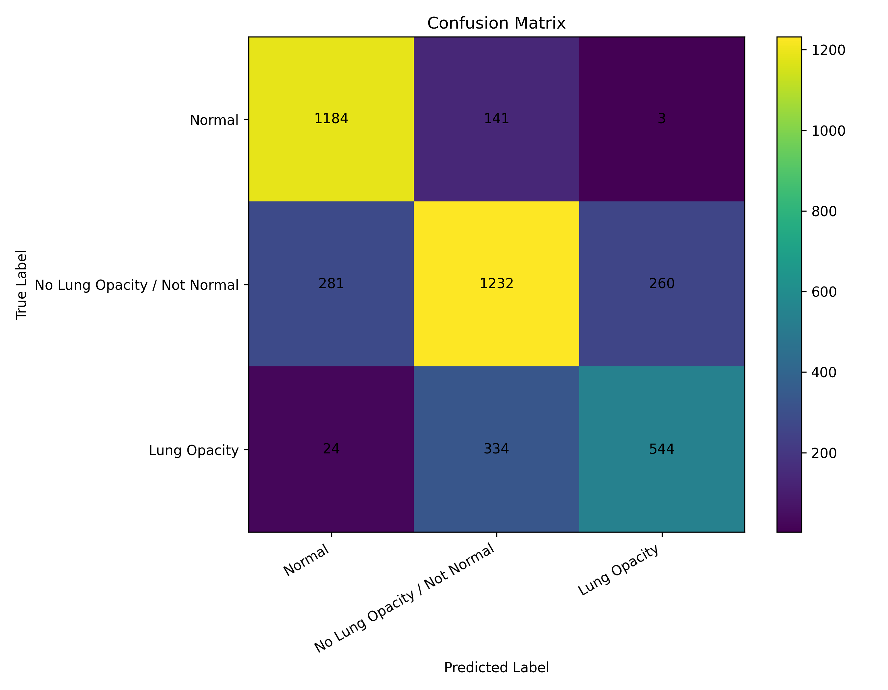

### ConvNeXt-Tiny Normalized Confusion Matrix

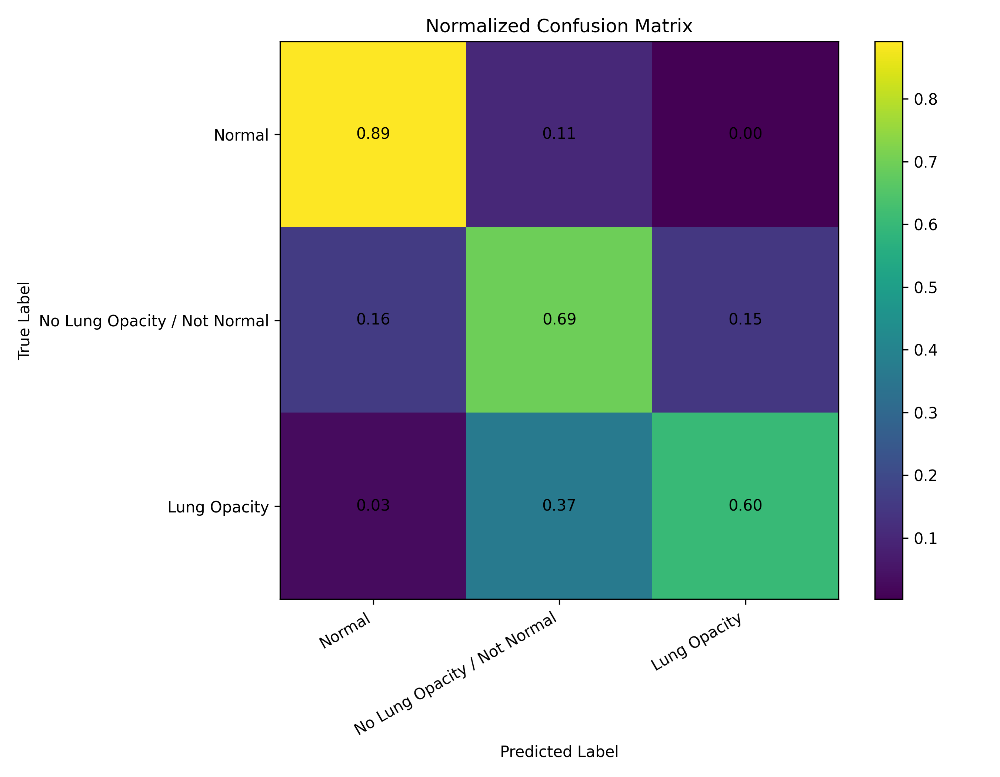

### Threshold Tuning Curve

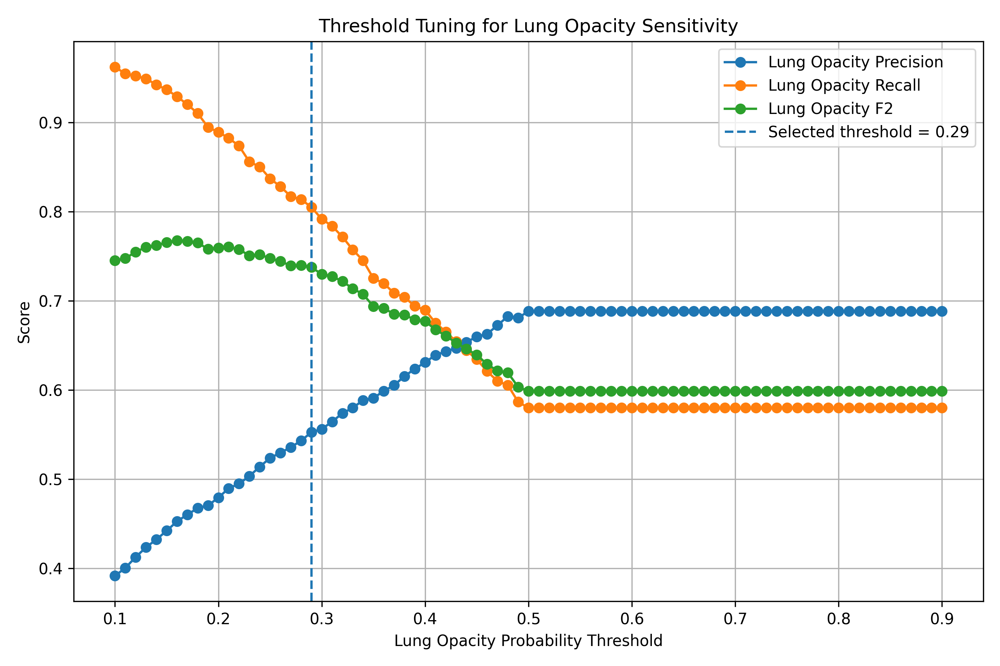

### High-Sensitivity Triage Confusion Matrix

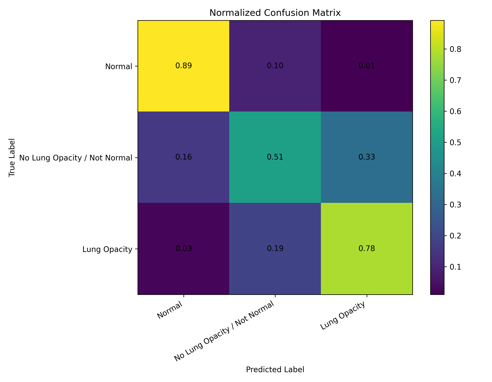

### Training Curves

#### Loss Curve

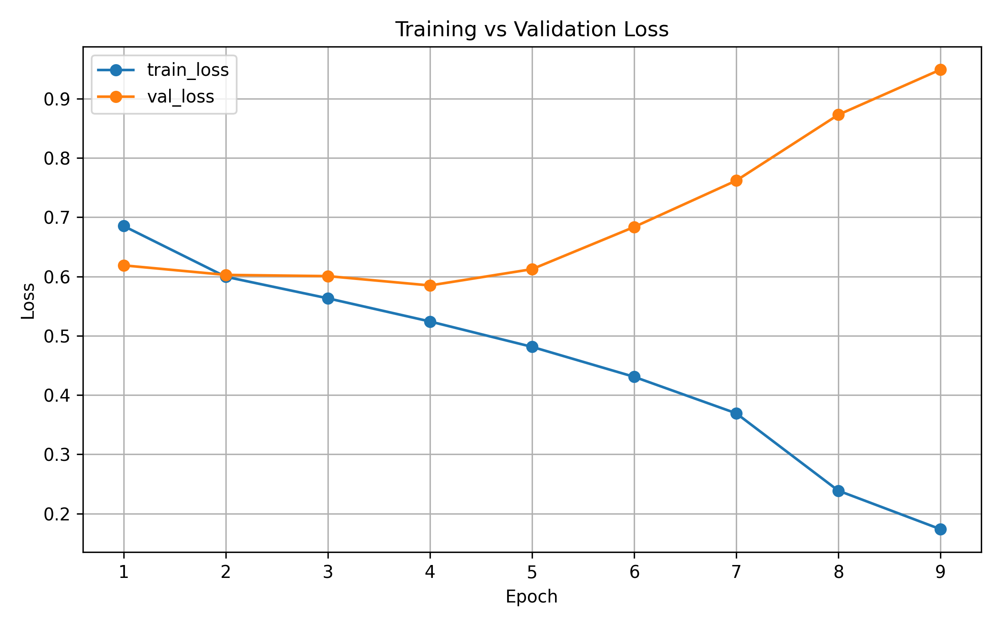

#### Accuracy Curve

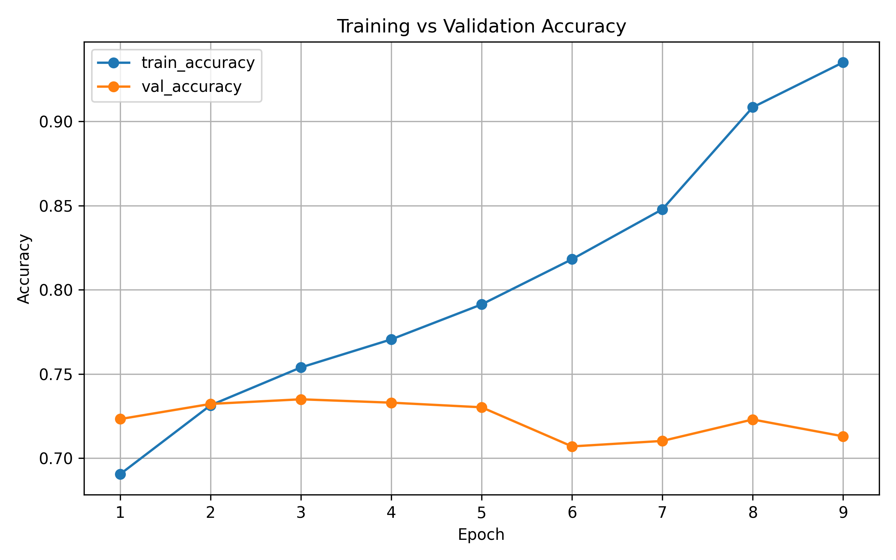

#### Macro Metrics Curve

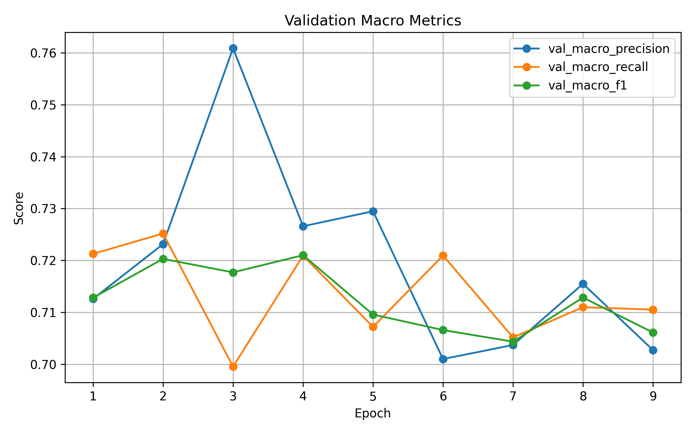

---

## Grad-CAM Explainability

Grad-CAM is used to visualize which image regions influenced the model prediction.

The explainability module supports:

- predicted-class Grad-CAM
- Lung Opacity-specific Grad-CAM
- correct prediction analysis
- failure-case analysis
- Grad-CAM gallery generation

### Grad-CAM Gallery

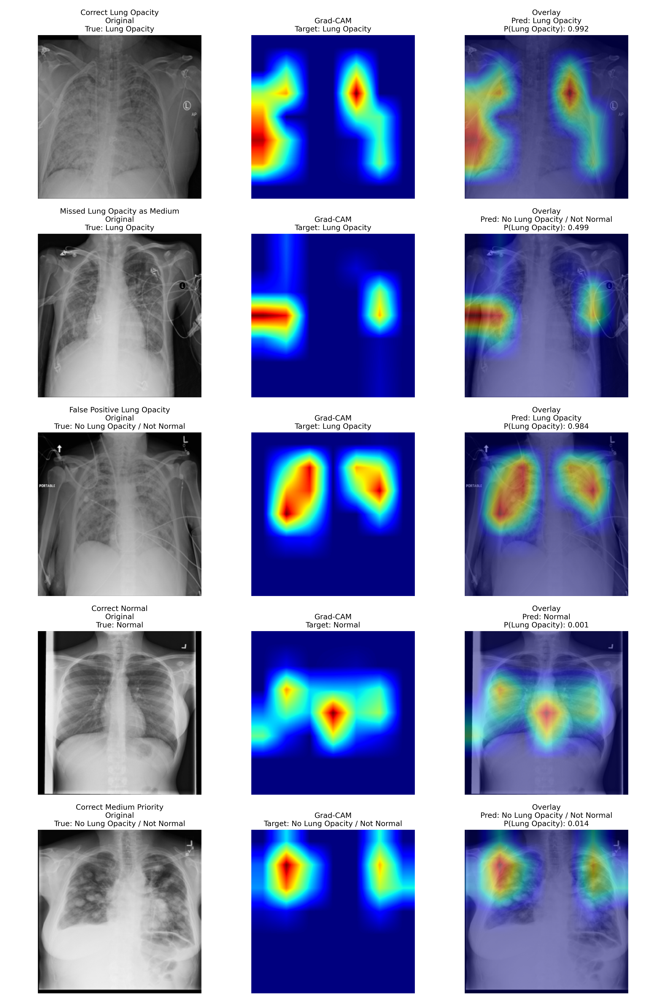

### Example Grad-CAM Cases

Correct Lung Opacity prediction:

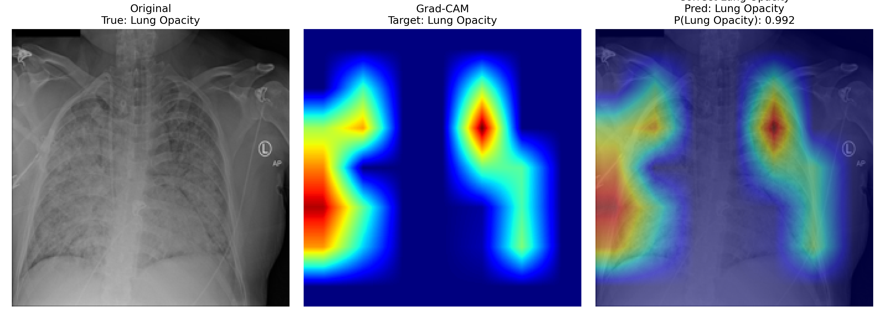

Missed Lung Opacity predicted as Medium Priority:

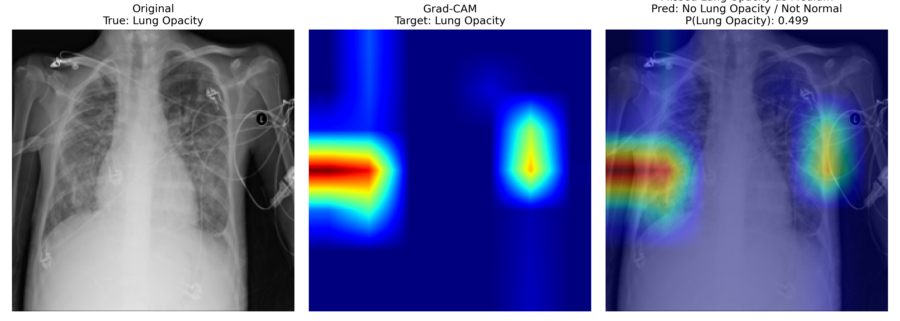

False Positive Lung Opacity:

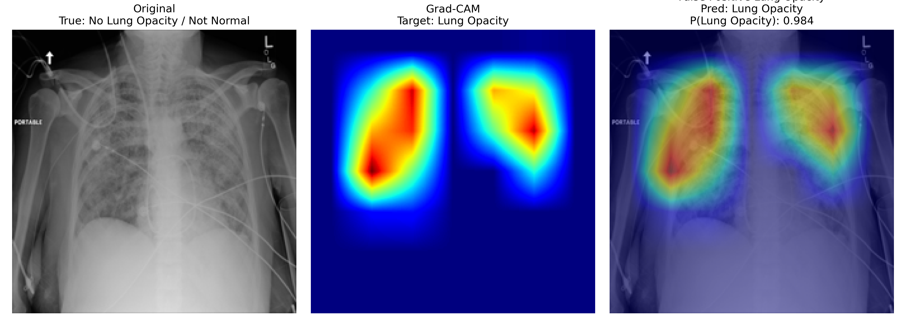

Correct Normal prediction:

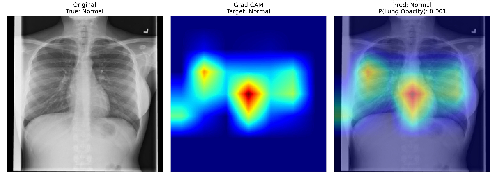

Correct Medium Priority prediction:

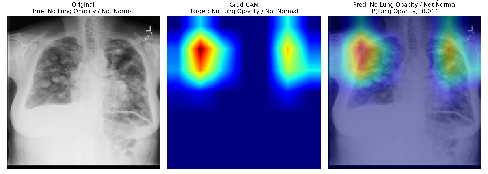

---

## Demo Interfaces

### Streamlit Demo

The Streamlit app allows users to upload a chest X-ray image, run inference, choose between balanced and high-sensitivity triage mode, view class probabilities, and generate Grad-CAM explanations.

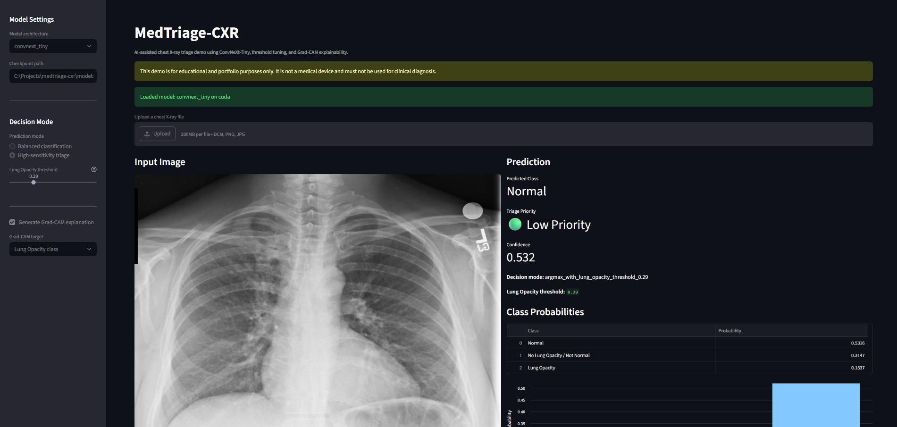

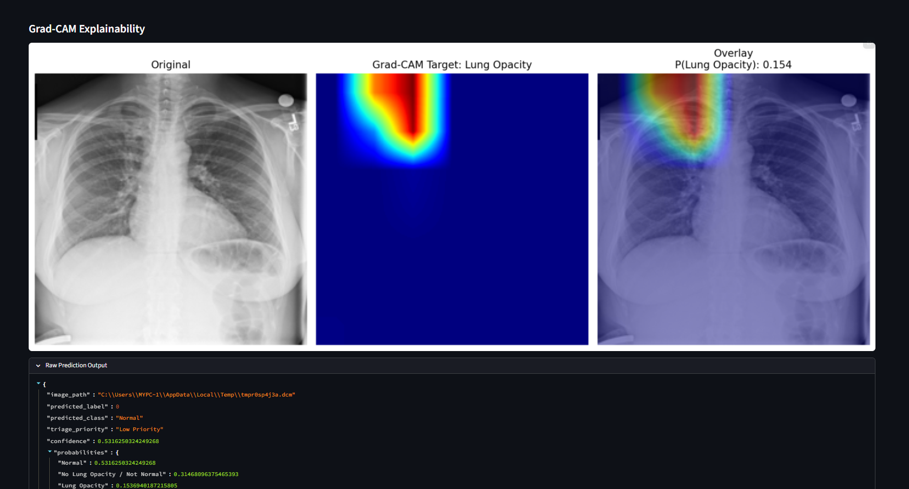

### FastAPI Inference API

The FastAPI endpoint provides production-style model serving through REST API endpoints. It supports health checks, model information, and file-based prediction through Swagger UI.

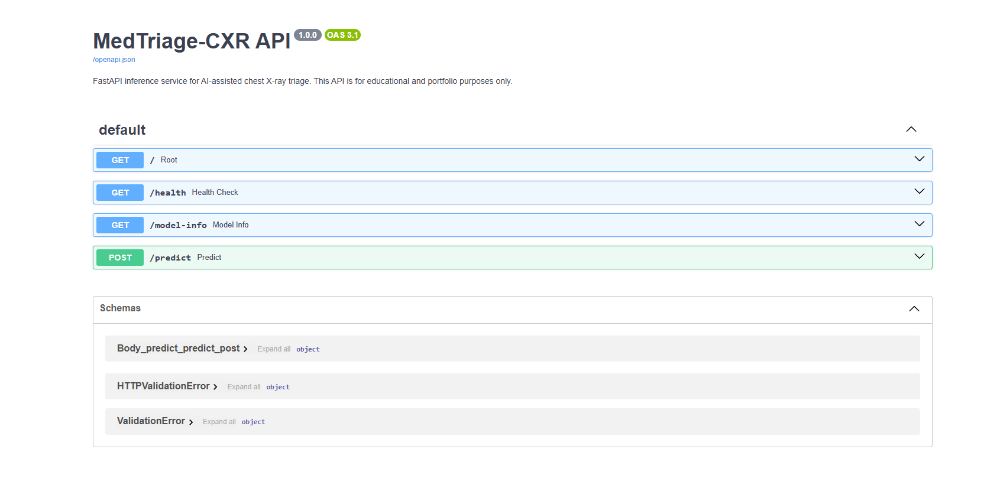

---

## Running the Project

### Install Dependencies

```bash
pip install -r requirements.txt
```

Install PyTorch separately based on CUDA or CPU support.

For CUDA-enabled GPU installation:

```bash
pip install torch torchvision torchaudio --index-url https://download.pytorch.org/whl/cu121
```

For CPU-only installation:

```bash
pip install torch torchvision torchaudio
```

### Prepare Data

After downloading and extracting the RSNA dataset into `data/raw/`, run:

```bash
python src/data/create_metadata.py
python src/data/create_splits.py
python src/data/validate_dicom_files.py
```

### Train ConvNeXt-Tiny

```bash
python src/training/train.py --model-name convnext_tiny --epochs 20 --batch-size 8
```

Resume interrupted training:

```bash
python src/training/train.py --model-name convnext_tiny --epochs 20 --batch-size 8 --resume
```

### Evaluate the Model

```bash
python src/evaluation/evaluate.py --model-name convnext_tiny --checkpoint models/best_convnext_tiny.pth --output-name convnext_tiny
```

### Run Threshold Tuning

```bash
python src/evaluation/tune_thresholds.py --model-name convnext_tiny --checkpoint models/best_convnext_tiny.pth --output-name convnext_tiny_threshold_tuned --batch-size 8 --min-precision 0.55 --beta 2.0
```

### Generate Grad-CAM Gallery

```bash
python src/explainability/gradcam_gallery.py --model-name convnext_tiny --checkpoint models/best_convnext_tiny.pth --csv data/processed/clean_test.csv --predictions reports/test_predictions_convnext_tiny.csv --output-name convnext_tiny --max-per-case 1
```

---

## Streamlit App

Run the Streamlit app:

```bash
streamlit run app/streamlit_app.py
```

The app supports:

- DICOM, PNG, JPG, and JPEG upload
- balanced classification mode
- high-sensitivity triage mode
- class probability visualization
- triage priority display
- Grad-CAM explanation

---

## FastAPI Inference API

Run the API server:

```bash
uvicorn app.api:app --reload
```

Open the API documentation:

```text
http://127.0.0.1:8000/docs
```

Available endpoints:

```text
GET  /
GET  /health
GET  /model-info
POST /predict
```

The `/predict` endpoint accepts a chest X-ray file and returns:

- predicted class
- triage priority
- confidence score
- class probabilities
- decision mode
- threshold used

Prediction modes:

```text
mode=balanced
mode=high_sensitivity
```

---

## Key Engineering Features

This project includes several production-oriented ML engineering practices:

- modular project structure
- relative image paths for portability
- DICOM loading and validation
- corrupted image filtering before training
- train, validation, and test splitting
- PyTorch Dataset and DataLoader pipeline
- transfer learning with ResNet50 and ConvNeXt-Tiny
- mixed precision training
- early stopping
- resumable checkpoint training
- best-checkpoint and latest-checkpoint saving
- validation-based threshold tuning
- high-sensitivity triage mode
- Grad-CAM explainability
- Streamlit demo interface
- FastAPI inference endpoint
- Git-based version control

---

## Limitations

This project has several important limitations:

- The system is not clinically validated.
- The model is trained on a public challenge dataset, not a hospital deployment dataset.
- The classification task is simplified into three classes.
- The model does not perform bounding-box localization or segmentation.
- Grad-CAM provides qualitative explanation but does not prove clinical correctness.
- Threshold tuning improves recall but increases false positives.
- The system is intended only for educational and portfolio demonstration.

---

## Future Work

Possible improvements include:

- Add EfficientNetV2 or Swin Transformer models
- Add model confidence calibration
- Add temperature scaling
- Add Docker support
- Add cloud deployment
- Add MLflow or Weights & Biases experiment tracking
- Add automated unit tests for inference
- Add ONNX export for lightweight deployment
- Add batch inference support
- Add model monitoring and drift detection
- Add better clinical-style reporting

---

## Author

Shibam Chakraborty
